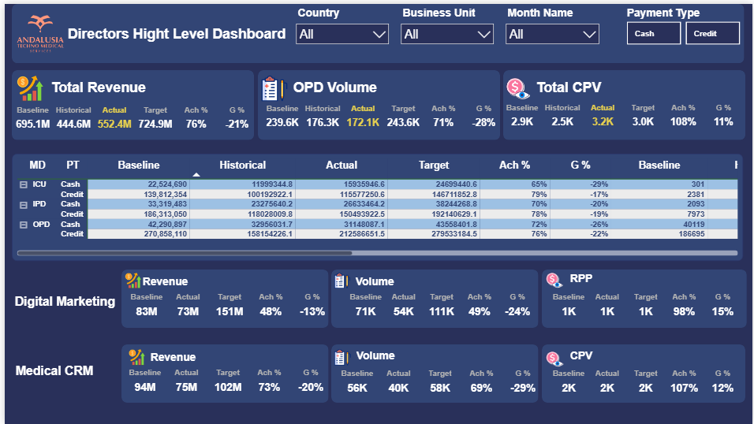
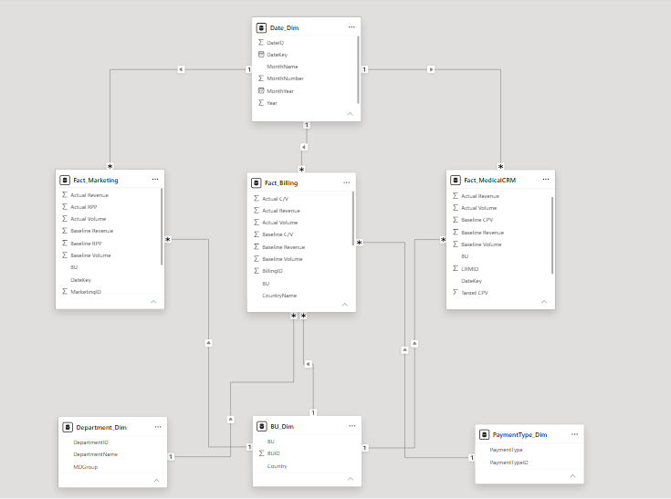

# 🏥 Andalusia Healthcare — Directors High Level Dashboard

> An end-to-end Power BI solution for a multi-branch hospital group operating across **Egypt** and **Saudi Arabia**, delivering executive-level insights across Billing, Digital Marketing, and Medical CRM performance.

---


---

## 📊 Dashboard Preview



---

## 🎯 Project Overview

This project was built as a complete Business Intelligence solution for **Andalusia Techno Medical Services**, a healthcare group with multiple branches (AMH, ASH in Egypt — HJH in Saudi Arabia).

The goal was to give Directors a single, filterable view to monitor performance across three business processes — **Billing**, **Digital Marketing**, and **Medical CRM** — comparing Actual results against Baseline, Historical, and Target benchmarks.

---

## 🗂️ Data Sources

Three raw Excel sheets were provided as input:

| Sheet | Grain | Key Metrics |
|---|---|---|
| **Billing Data** | Country × BU × Month × Department × Payment Type | Revenue, Volume, C/V |
| **Marketing Data** | BU × Month | Revenue, Volume, RPP |
| **Medical CRM Data** | BU × Month | Revenue, Volume, CPV |

---

## 🏗️ Data Model — Galaxy Schema



The model follows a **Galaxy Schema** (multiple fact tables sharing conformed dimensions):

### Fact Tables
| Table | Rows | Grain |
|---|---|---|
| `Fact_Billing` | 146 | Country + BU + Month + Department + Payment Type |
| `Fact_Marketing` | 9 | BU + Month |
| `Fact_MedicalCRM` | 9 | BU + Month |

### Dimension Tables
| Table | Description |
|---|---|
| `Dim_Date` | Month, Month Number, Year — shared across all 3 facts |
| `Dim_BU` | Business Unit + Country mapping (conformed dimension) |
| `Dim_Department` | 10 medical departments with MDGroup mapping (IPD / ICU / OPD) |
| `Dim_PaymentType` | Cash / Credit |

> `Dim_Date` and `Dim_BU` are **conformed dimensions** — connecting all three fact tables simultaneously, which is the defining characteristic of the Galaxy Schema.

---

## ⚙️ Data Preprocessing

All preprocessing was handled **inside Power Query** (not in the source Excel), following BI best practices:

- Unified `Month` column to a real `DateKey` (Date type) across all three sheets — handling the missing year in Marketing data
- Replaced `null` values in numeric columns with `0` after validating the business reason (zero activity or non-applicable metric)
- Applied `Trim` and `Clean` on all text columns to remove stray spaces
- Removed duplicate rows (verified — none existed)
- Added `Surrogate Keys` (BillingID, MarketingID, CRMID) to all fact tables
- Built `MDGroup` mapping column in `Dim_Department` to group 10 departments into 3 executive categories (IPD / ICU / OPD)
- Built all Dimension tables as **Reference queries** from Fact_Billing — ensuring a single source of truth

---

## 📐 DAX Measures

All measures are organized in **3 dedicated measure tables** with Display Folders:

### Core Logic

```dax
-- Achievement vs Target
Revenue Ach % = DIVIDE([Total Actual Revenue], [Total Target Revenue])

-- Growth vs Baseline
Revenue G % = DIVIDE([Total Actual Revenue] - [Total Baseline Revenue], [Total Baseline Revenue])

-- Cost per Visit (recalculated from totals, not from raw C/V column)
Total Actual CV = DIVIDE([Total Actual Revenue], [Total Actual Volume])
```

> `DIVIDE()` is used throughout instead of `/` to handle zero-division gracefully (returns BLANK instead of error).

### Measure Tables

| Table | Measures | Folders |
|---|---|---|
| `_Measures_Billing` | 18 | Revenue / Volume / CV / Ach and G% |
| `_Measures_Marketing` | 15 | Revenue / Volume / RPP / Ach and G% |
| `_Measures_CRM` | 15 | Revenue / Volume / CPV / Ach and G% |

---

## 📋 Dashboard Features

### Filters (Slicers)
- **Country** — Egypt / Saudi Arabia
- **Business Unit** — AMH / ASH / HJH
- **Month Name** — March / April / May 2025
- **Payment Type** — Cash / Credit (Tile style)

### KPI Cards (Top Row)
- **Total Revenue** — Baseline | Historical | Actual | Target | Ach% | G%
- **OPD Volume** — same structure, filtered to OPD departments only
- **Total CPV** — Baseline | Historical | Actual | Target | G%

### MD Performance Matrix
A dynamic matrix showing Revenue, Volume, and CPV across:
- **Rows:** MDGroup (ICU / IPD / OPD) → Payment Type (Cash / Credit)
- **Columns:** Metric Groups (Revenue / Volume / CPV) → Sub-metrics (Baseline / Historical / Actual / Target / Ach% / G%)

### Bottom Section
- **Digital Marketing** — Revenue | Volume | RPP with Ach% and G%
- **Medical CRM** — Revenue | Volume | CPV with Ach% and G%

---

## 🎨 Design

The dashboard follows a custom dark navy theme inspired by the Andalusia brand:

| Element | Hex Code |
|---|---|
| Primary Background | `#2C3E70` |
| Card / Section Background | `#2B3D6E` |
| Slicer Background | `#303868` |
| Actual Value Highlight | `#FEE24D` |
| Table Row (alternating) | `#BDDFFF` / `#FFFFFF` |
| Primary Text | `#FFFFFF` |

---

## 🛠️ Tools & Technologies

| Tool | Purpose |
|---|---|
| **Power BI Desktop** | Data modeling, DAX, dashboard design |
| **Power Query (M)** | Data preprocessing and transformation |
| **DAX** | Measures (Ach%, G%, CV, RPP, CPV) |
| **Excel** | Raw data source |
| **Galaxy Schema** | Multi-fact data model architecture |

---

## 📁 Repository Structure

```
andalusia-healthcare-bi-dashboard/
│
├── 📊 Andalusia_Healthcare_Dashboard.pbix
├── 📄 README.md
└── 📁 assets/
    ├── landing_page.png
    ├── dashboard_preview.png
    └── data_model.png
```

---

## 👤 Author

**Ahmed El-Sayed**
BI Developer | Data Analyst
